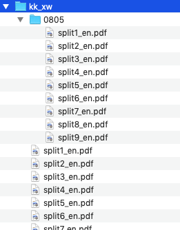
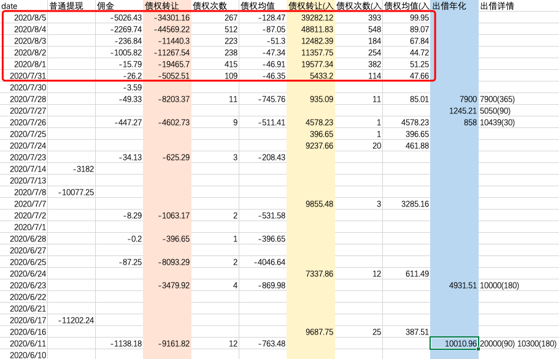
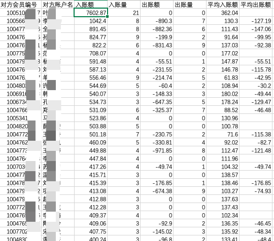

某网贷平台近期转债停滞，新网银行流水异常增多，用 python 将数据提取出来并分析。

### 文件准备

从该平台官网下载自己的出借协议，放到一个文件夹下。

可以用 [pdf_con_sort.py](./tools/pdf_con_sort.py) 将文件进行重命名排序，参见 [tools](./tools) 。

从新网银行公众号，下载管存账户的流水，例如，下载全部流水（2017-01-01到昨天），收到邮件后将附件中的pdf解压到一个文件夹下，之后每天申请前一天的流水，下载到该文件夹下的单独目录，如：

### 运行环境

- python3
- python2（不推荐，未测试）

依赖包：

- pdfplumber

### 每日数据统计分析

	py pdf_table_ana.py <流水pdf目录> -p <pdf密码> -c <协议pdf目录>

每天新申请的协议pdf文件放到流水pdf目录下的单独新目录后，再次执行上述脚本，会增量提取这部分pdf数据，然后重新计算全部数据。

8月6号生成的统计数据部分截图：

可见7月31号之后，我这个账户没有任何投资或回款，但转债异常频繁，佣金也异常高。我另外一个账户的统计分析也是这样的情况，4号的转债和佣金与这个账户5号的相当。不能不让人怀疑这有点穷途末路之感……

### 近期异常转债目标账户分析

有传言说最近疯狂转债的账户是虚假的，也有说是大户（关系户？），下面分析7月31号之后的异常转债的目标账户（对方账户）：

	py pdf_table_ana.py <流水pdf目录> --fr 2020-07-31 --target  # 如果有新增pdf则需要加上 -p <pdf密码>

默认是以入账额排序的，按出账额排序加上 `--sort 2` 即可。

从统计得到的数据来看，出账没有特别明显的异常高值，入账有：

其中隐含的信息就无从所知了……

